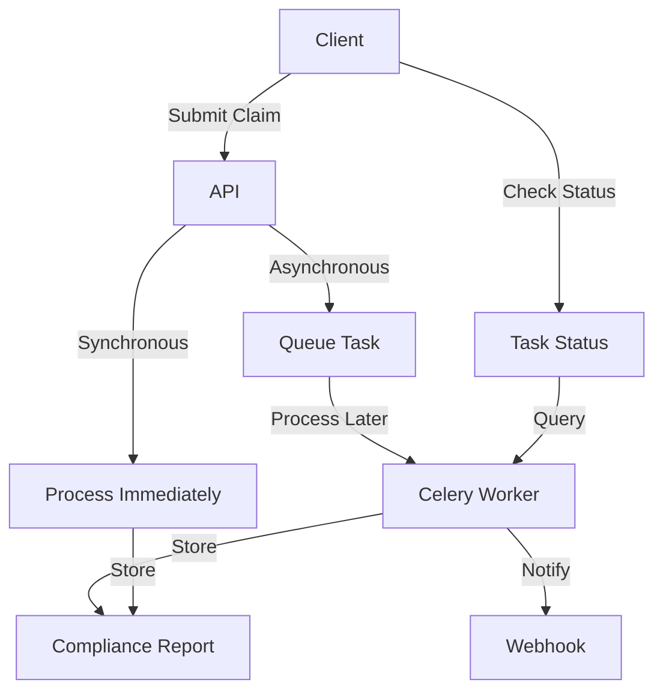
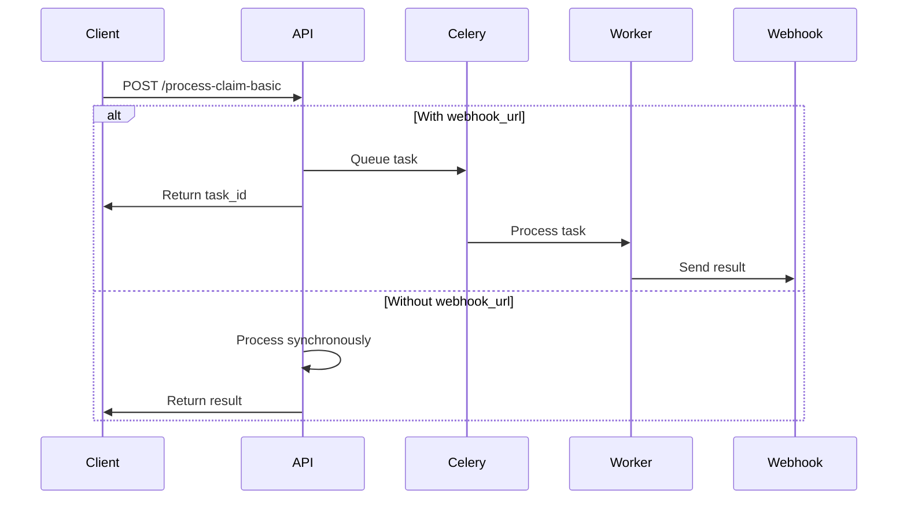
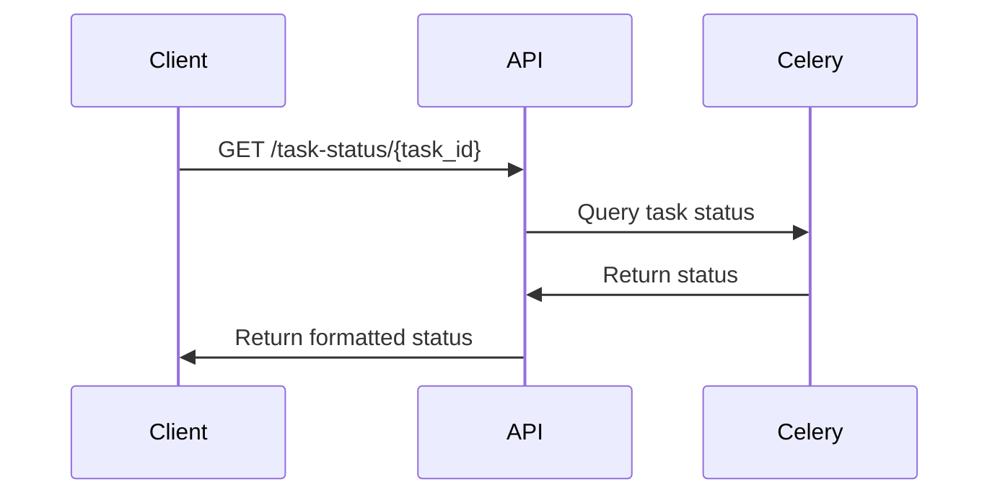
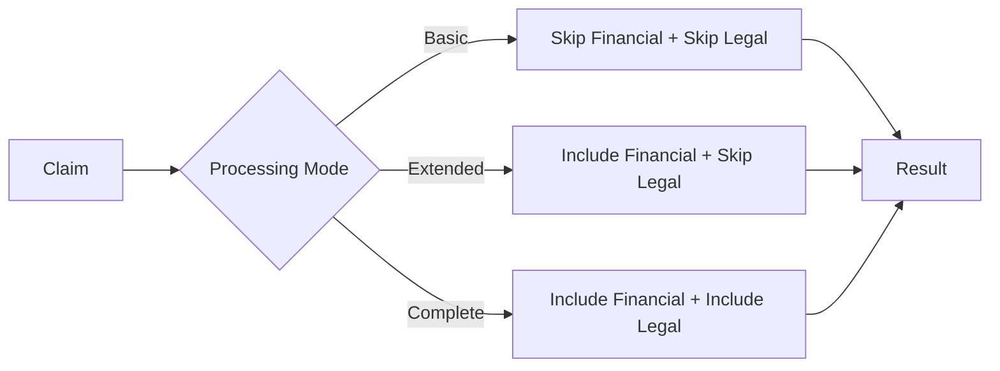
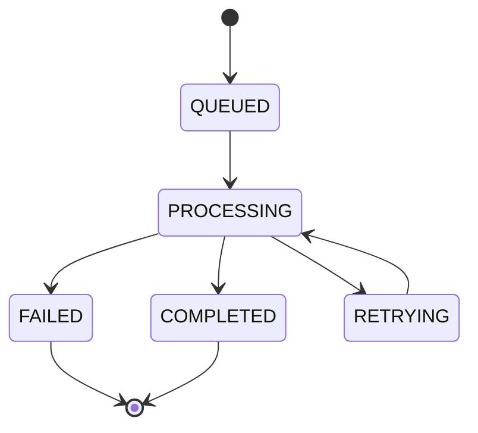
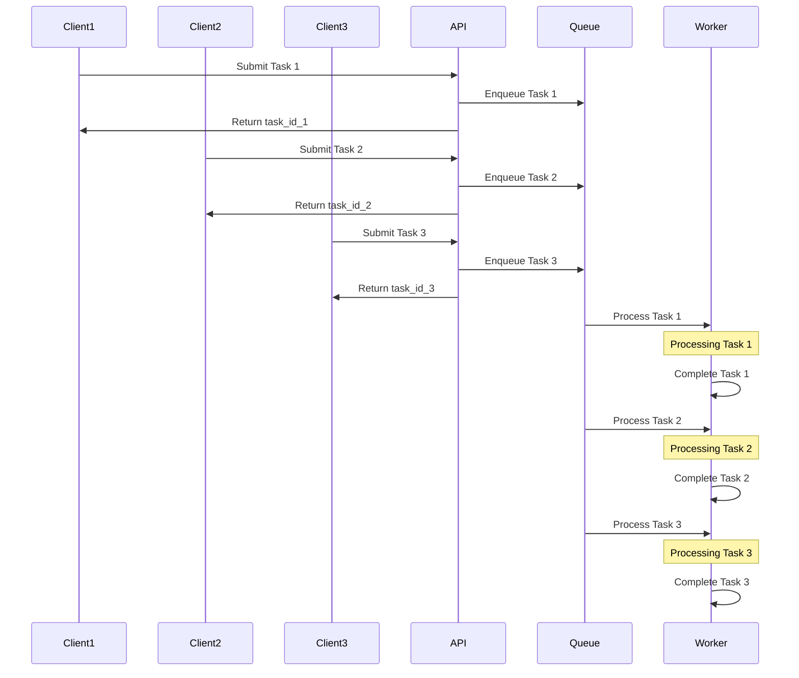

# Firm Compliance Claim Processing API

## Overview

The Firm Compliance Claim Processing API provides endpoints for processing business compliance claims and managing cached compliance data. It supports multiple processing modes, asynchronous task queuing, and webhook notifications for processed claims.



## Setup and Installation

### Prerequisites

- Python 3.8+
- Redis server (for Celery task queue)
- FastAPI
- Celery

### Installation

1. Install required packages:

```bash
pip install fastapi uvicorn celery redis aiohttp
```

2. Start Redis server:

```bash
redis-server
```

3. Start the API server:

```bash
uvicorn api:app --host 0.0.0.0 --port 8000 --log-level info
```

4. Start Celery worker:

```bash
celery -A api.celery_app worker --loglevel=info
```

## API Endpoints

### Claim Processing

The API offers three processing modes with different levels of detail:

| Mode | Endpoint | Description |
|------|----------|-------------|
| Basic | `/process-claim-basic` | Minimal processing: skips financial and legal reviews |
| Extended | `/process-claim-extended` | Extended processing: includes financial reviews, skips legal |
| Complete | `/process-claim-complete` | Full processing: includes financial and legal reviews |



### Task Status

Check the status of asynchronous tasks:

- `GET /task-status/{task_id}` - Get the current status of a task



### Cache Management

Manage cached data:

- `POST /cache/clear/{business_ref}` - Clear cache for a specific business
- `POST /cache/clear-all` - Clear all cache
- `POST /cache/clear-agent/{business_ref}/{agent_name}` - Clear cache for a specific agent
- `GET /cache/list` - List cached files
- `POST /cache/cleanup-stale` - Delete stale cache

### Compliance Retrieval

Retrieve compliance reports:

- `GET /compliance/latest/{business_ref}` - Get latest compliance report
- `GET /compliance/by-ref/{business_ref}/{reference_id}` - Get compliance report by reference ID
- `GET /compliance/list` - List compliance reports
- `GET /compliance/summary/{business_ref}` - Get compliance summary
- `GET /compliance/all-summaries` - Get all compliance summaries

### Settings

Manage API settings:

- `PUT /settings` - Update API settings
- `GET /settings` - Get current settings
- `GET /processing-modes` - Get available processing modes

## Request Examples

### Basic Claim Processing (Asynchronous)

```json
POST /process-claim-basic
{
  "reference_id": "REF123",
  "business_ref": "BIZ123",
  "business_name": "Example Corp",
  "tax_id": "123456789",
  "organization_crd": "987654",
  "webhook_url": "https://webhook.site/your-webhook-id"
}
```

Response:

```json
{
  "status": "processing_queued",
  "reference_id": "REF123",
  "task_id": "task-id-123",
  "message": "Claim processing queued; result will be sent to webhook"
}
```

### Basic Claim Processing (Synchronous)

```json
POST /process-claim-basic
{
  "reference_id": "REF123",
  "business_ref": "BIZ123",
  "business_name": "Example Corp",
  "tax_id": "123456789",
  "organization_crd": "987654"
}
```

Response:

```json
{
  "reference_id": "REF123",
  "claim": {
    "reference_id": "REF123",
    "business_ref": "BIZ123",
    "business_name": "Example Corp",
    "tax_id": "123456789",
    "organization_crd": "987654"
  },
  "search_evaluation": {
    "compliance": true,
    "compliance_explanation": "Business found in records"
  },
  "status_evaluation": {
    "compliance": true,
    "compliance_explanation": "No issues found in status checks"
  },
  "name_evaluation": {
    "compliance": true,
    "compliance_explanation": "Business name matches fetched record"
  },
  "final_evaluation": {
    "compliance": true,
    "compliance_explanation": "All checks passed",
    "overall_risk_level": "Low"
  }
}
```

### Check Task Status

```
GET /task-status/task-id-123
```

Response:

```json
{
  "task_id": "task-id-123",
  "status": "PROCESSING",
  "reference_id": "REF123",
  "result": null,
  "error": null
}
```

## Processing Modes

The API supports three processing modes with different levels of detail:

1. **Basic Mode** (`/process-claim-basic`):
   - Minimal processing
   - Skips financial and legal reviews
   - Fastest processing time

2. **Extended Mode** (`/process-claim-extended`):
   - Includes financial reviews
   - Skips legal reviews
   - Medium processing time

3. **Complete Mode** (`/process-claim-complete`):
   - Includes financial and legal reviews
   - Most comprehensive
   - Longest processing time



## Webhook Functionality

When a webhook URL is provided in the request, the API will:

1. Queue the task for asynchronous processing
2. Return a task ID immediately
3. Process the task in the background
4. Send the result to the provided webhook URL when processing is complete

The webhook payload will contain:

```json
{
  "reference_id": "REF123",
  "status": "success",
  "result": {
    "compliance": true,
    "compliance_explanation": "All checks passed",
    "overall_risk_level": "Low"
  }
}
```

If an error occurs during processing, the webhook will receive:

```json
{
  "status": "error",
  "reference_id": "REF123",
  "message": "Claim processing failed: [error details]"
}
```

## Task Status Tracking

Task status can be tracked using the `/task-status/{task_id}` endpoint. Possible status values:

- `QUEUED` - Task is waiting to be processed
- `PROCESSING` - Task is currently being processed
- `COMPLETED` - Task has completed successfully
- `FAILED` - Task has failed
- `RETRYING` - Task failed and is being retried



## Concurrency Control

The API implements concurrency control to ensure tasks are processed reliably:

- Tasks are processed in FIFO (First In, First Out) order
- Only one task is processed at a time (`task_concurrency=1`)
- Failed tasks are automatically retried up to 3 times
- Tasks are processed sequentially to prevent race conditions



## Error Handling

The API implements robust error handling:

- Failed tasks are automatically retried up to 3 times
- Webhook failures are isolated from task processing
- Detailed error messages are provided in responses
- Task status tracking includes error information

## Cache Management

The API provides endpoints for managing cached data:

- Clear cache for specific businesses or agents
- List cached files with pagination
- Clean up stale cache automatically
- Retrieve cached compliance reports

## Best Practices

1. **Use Asynchronous Processing for Long-Running Tasks**:
   - Include a `webhook_url` for tasks that may take time to process
   - Use task status tracking to monitor progress

2. **Choose the Appropriate Processing Mode**:
   - Use `basic` mode for quick checks
   - Use `extended` or `complete` modes for more thorough analysis

3. **Provide Sufficient Identifiers**:
   - At least one of `business_name`, `tax_id`, or `organization_crd` must be provided
   - More identifiers improve matching accuracy

4. **Implement Webhook Error Handling**:
   - Your webhook endpoint should return a 200 status code
   - Implement retry logic in your webhook handler

5. **Monitor Task Status**:
   - Use the `/task-status/{task_id}` endpoint to check task progress
   - Handle potential task failures in your client application